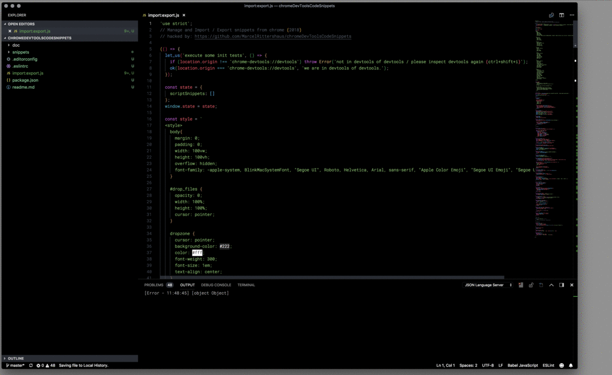

# Chrome DevTool CodeSnippets

A collection of helpful snippets to use inside of browser devtools.

## Motivation

The motivation of this project is to get web sites quickly to the needed informatics to facilitate the debugging. In addition to general snippets for CSS and Javascript, the repro also includes snippets for the special Javascript APIs, e.g. PrebidJS, TealiumJs, LazySizesJS, ...

## Contribute

If you have a useful snippet or updates to an existing one that you'd like to share, please contribute it or open an issue!  Feel free to use, modify, or share any of these snippets.

## Installation

### Step 1

Open your IDE and copy the javascript code of the import / export.js file

### Step 2

Open any website in Google Chrome

### Step 3

Open the snippet area in the DeveloperTool (option + cmd + i) in the Source tab and create a new snippet - the DeveloperTool should be open in a separate window

### Step 4

Paste the code of the file import / export.js and save.

### Step 5

Highlight the snippet and repeatedly open the DeveloperTool (option + cmd + i) to open another DeveloperTool window. Activate the snippet in the new opened window by selecting "Run" in the context menu - the import / export tool opens.

### Step 6

Select those javascript files in the snippets file structure you want to use.

### Step 7

Drag and drop the corresponding files into the window of the import / export tool and click save

### Step 8

In Google Chrome, a dialog will pop up - you may need to move the other windows to see it - confirm the dialog and then close all DeveloperTools windows

### Step 9

Open the Google Chrome Developer Tools. The snippets were imported

## Snippets

- __browserViewCookies.js__:

Shows all cookies stored in document.cookies in a console.table

### CSS

- __cssInsertCss.js__:

Injects a snippet of CSS into the current page.

- __cssLayout.js__:
  tiny CSS layout "debugger" puts random color border around each element

- __cssOverlay.js__:
  draw an css overlay

- __cssPrettifier.js__:
  Script for unminifying and prettifying a CSS file written by addyosmani and sindresorhus. View the cssprettifier-bookmarklet project on github.

- __cssReload.js__:
  Removes then reloads all the CSS files in the current page

### HTML

- __htmlContenti18n.js__:
  Generate downloadable chrome.i18n messages file for location.href.

- __htmlDesignModeOn.js__:
  Edit any text on the page

- __htmlFormControls.js__:
  Shows all html form elements with their values and types in a nice table.

- __htmlFormPlain.js__:
  Remove HTML5 form features (validations and special input types).

- __htmlHashlink.js__:
  Run it, then click on an element, and it will give you the closest #link to that page.

- __htmlRemoveAllBut.js__:
  Removes all elements except for the trees rooted
in the given selectors. Selectors are queried using querySelectorAll.
For example, hideAllBut('.foo', '#baz'), given a document

- __htmlWrapElement.js__:
  Wrap a given element in a given type of element
wrapElement('.foo', 'h1');
wrapElement(document.querySelector('#bar'), 'div');

### Javascript

#### Ads

- __jsAdsShowAllGoogleDFP.js__:
  Open Google DPF Console and show all bids

- __jsAdsShowAllPrebidJSBids.js__:
  See all PrebidJS bids in the console

- __jsAdsShowAllPrebidJSWinners.js__:
  See all winning bids from PrebidJS in the console

#### debugg

- __jsLogDevicePX.js__:
  Log browser window hight, width and divce pixel ratio

- __jsLogEventClickedTarget.js__:
  Useful for finding target node attributes and values

- __jsLogEventMouseMove.js__:
  Log the current mouse postion on move

- __jsLogGlobals.js__:
  Useful for finding leaked global variables.

- __jsLogOS.js__:
  log system and browser infos

#### Tracking

- __jsTrackingTealium.js__:
  Built-in debugging functionality for the utag files.

#### Log

- __log4ConsoleLog.js__:
  Adds a `log` function to window object.

- __logSaveConsoleLogs.js__:
  A simple way to save objects as .json files from the console

#### Test

- __jsTestScriptInjection.js__:
  This code snippet checks if the page allows creating
  and executing new inline scripts (script-injection attacks)

#### Media

- __mediaDataUrl.js__:
  Convert all images on the page to data URLs. Note: this only works for images that are on the same domain as the current page.

#### Network

- __networkCachebuster.js__:
  Overwrite all link and (optionally) script tags by adding Date.now() at the end of href and src attributes, respectively. By default processing scripts is not performed, you should change the variable processScripts to true to run these.

- __networkPerformance.js__:
  Print out window.performance information

- __networkShowHeaders.js__:
  Print out response headers for current URL.

- __urlQueryStringValues.js__:
  Print out key/value pairs from querystring.

## To Use DevTools Snippets in Chrome

You can read more about [snippets at the Chrome developer tools documentation](https://developers.google.com/chrome-developer-tools/docs/authoring-development-workflow#snippets).

- Open Chrome.
- Go to "Snippets" tab, and add whichever ones you want.

## License
